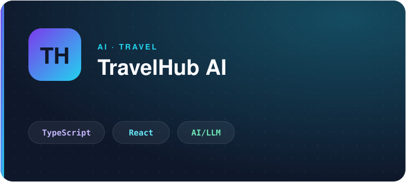
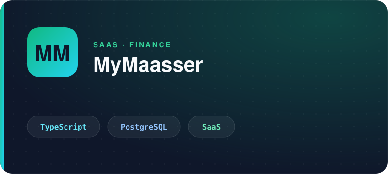
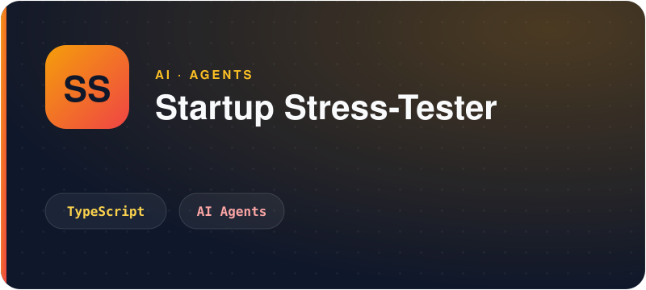
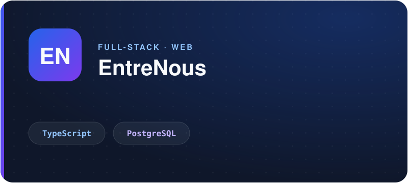
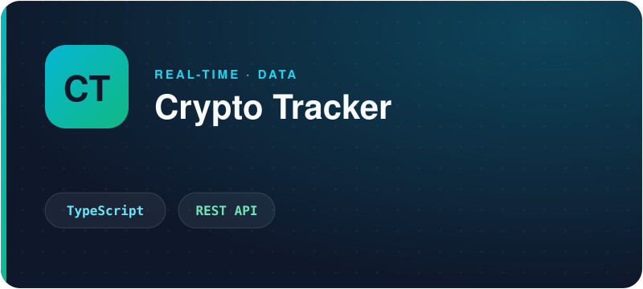
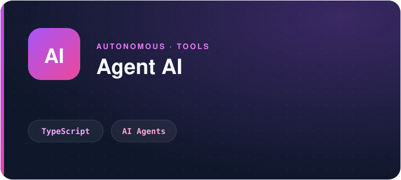

<!-- ══════════════════════════════ HERO ══════════════════════════════ -->
<p align="center">
  <picture>
    <source media="(prefers-color-scheme: dark)" srcset="assets/hero-dark.svg">
    <source media="(prefers-color-scheme: light)" srcset="assets/hero-light.svg">
    
  </picture>
</p>

<!-- ════════════════════════════ TERMINAL ════════════════════════════ -->
<p align="center">
  <picture>
    <source media="(prefers-color-scheme: dark)" srcset="assets/terminal-dark.svg">
    <source media="(prefers-color-scheme: light)" srcset="assets/terminal-light.svg">
    
  </picture>
</p>

<!-- ════════════════════════════ ABOUT ME ════════════════════════════ -->
## About

I build full-stack products end to end — from database and API to a polished interface.
My focus is applied **AI** and **automation**: shipping features that remove real friction, not demos.
I care about clean architecture, developer experience, and details that make software feel effortless.
Lately I work a lot with **Claude Code** and the **Model Context Protocol (MCP)** to build agentic tooling.
I studied Full Stack Development & AI at **John Bryce (Tel Aviv)** and I'm continuously building in the open.

---

<!-- ══════════════════════════ CURRENT FOCUS ═════════════════════════ -->
## Current Focus

<p>
  
  
  
  
  
  
  
</p>

---

<!-- ═════════════════════════ FEATURED PROJECTS ══════════════════════ -->
## Featured Projects

<table>
  <tr>
    <td width="50%" valign="top">
      <a href="https://travelhub-ai-eight.vercel.app">
        
      </a>
      <p align="center">
        AI-assisted travel planner that generates and organizes itineraries.<br>
        <a href="https://travelhub-ai-eight.vercel.app"><b>Live Demo</b></a> ·
        <a href="https://github.com/mordehailevy/travelhub-ai">Code</a>
      </p>
    </td>
    <td width="50%" valign="top">
      <a href="https://mymaasser.com">
        
      </a>
      <p align="center">
        SaaS app to track income and tithing, with a Postgres-backed backend.<br>
        <a href="https://mymaasser.com"><b>Live Demo</b></a>
      </p>
    </td>
  </tr>
  <tr>
    <td width="50%" valign="top">
      <a href="https://github.com/mordehailevy/startup-stress-tester">
        
      </a>
      <p align="center">
        AI-powered investor panel that stress-tests startup ideas from multiple angles.<br>
        <a href="https://github.com/mordehailevy/startup-stress-tester"><b>Code</b></a>
      </p>
    </td>
    <td width="50%" valign="top">
      <a href="https://entrenous.dev">
        
      </a>
      <p align="center">
        Full-stack web app built with TypeScript and a Postgres backend.<br>
        <a href="https://entrenous.dev"><b>Live Demo</b></a> ·
        <a href="https://github.com/mordehailevy/entrenous">Code</a>
      </p>
    </td>
  </tr>
  <tr>
    <td width="50%" valign="top">
      <a href="https://crypto-tracker-psi-ten.vercel.app">
        
      </a>
      <p align="center">
        Real-time cryptocurrency tracking dashboard with live market data.<br>
        <a href="https://crypto-tracker-psi-ten.vercel.app"><b>Live Demo</b></a> ·
        <a href="https://github.com/mordehailevy/crypto-tracker">Code</a>
      </p>
    </td>
    <td width="50%" valign="top">
      <a href="https://github.com/mordehailevy/lesson61-agent-ai">
        
      </a>
      <p align="center">
        Experiment in autonomous, tool-using AI agent workflows.<br>
        <a href="https://github.com/mordehailevy/lesson61-agent-ai"><b>Code</b></a>
      </p>
    </td>
  </tr>
</table>

---

<!-- ═══════════════════════════ TECH STACK ═══════════════════════════ -->
## Tech Stack

**Languages**


**Frontend**


**Backend**


**Database**


**Cloud & DevOps**


**AI & Automation**

<p>
  
  
  
  
  
</p>

---

<!-- ═════════════════════════ CONTRIBUTIONS ══════════════════════════ -->
## Contributions

<p align="center">
  <picture>
    <source media="(prefers-color-scheme: dark)" srcset="https://raw.githubusercontent.com/mordehailevy/mordehailevy/output/github-snake-dark.svg">
    <source media="(prefers-color-scheme: light)" srcset="https://raw.githubusercontent.com/mordehailevy/mordehailevy/output/github-snake.svg">
    
  </picture>
</p>

---

<!-- ═══════════════════════════ EDUCATION ════════════════════════════ -->
## Education

<p align="center">
  <picture>
    <source media="(prefers-color-scheme: dark)" srcset="assets/education-dark.svg">
    <source media="(prefers-color-scheme: light)" srcset="assets/education-light.svg">
    
  </picture>
</p>

---

<!-- ════════════════════════════ ROADMAP ═════════════════════════════ -->
## Roadmap

```text
✔  Artificial Intelligence
✔  Claude Code
✔  MCP (Model Context Protocol)
✔  SaaS
⬜  Kubernetes
⬜  Rust
⬜  Mobile
```

---

<!-- ════════════════════════════ CONTACT ═════════════════════════════ -->
## Contact

<p>
  <a href="https://github.com/mordehailevy"></a>
  <a href="mailto:mordehai.levy@gmail.com"></a>
</p>

---

<p align="center"><sub>Built with care — clean code, real data, no filler.</sub></p>
