<!-- ═══════════════════════════ HERO BANNER ═══════════════════════════ -->
<picture>
  <source media="(prefers-color-scheme: dark)" srcset="dark.svg">
  <source media="(prefers-color-scheme: light)" srcset="light.svg">
  
</picture>

<!-- ═══════════════════════════ TYPING + BADGES ═══════════════════════════ -->
<div align="center">

<a href="https://git.io/typing-svg">
  
</a>

<p>
  
  
</p>

<p>
  <a href="mailto:mordehai.levy@gmail.com"></a>
  <a href="https://github.com/mordehailevy"></a>
</p>

<p>
  
  
  
</p>

</div>

---

<!-- ═══════════════════════════ ABOUT ═══════════════════════════ -->
## About

I'm **MordehAI** — a **Full-Stack & AI Developer** who enjoys shipping real products end to end, from the database to the interface, with a strong focus on **AI-powered automation** and practical LLM-driven features.

- Trained in **Full-Stack & AI Development** at **John Bryce**.
- Currently working as a **Développeur AI / Full-Stack @ M2N Energie**.
- I build with a **product engineering mindset** — I care about UX, clean code, and things that actually ship.
- Comfortable across the **TypeScript / React / Node** stack and integrating **AI agents & automation** into web apps.

> **Open to:** freelance & collaboration on full-stack and AI projects.

---

<!-- ═══════════════════════════ TECH STACK ═══════════════════════════ -->
## Tech Stack

**Languages**


**Frontend**


**Backend & Databases**


**AI, Cloud, DevOps & Tooling**


---

<!-- ═══════════════════════════ AI / ML FOCUS ═══════════════════════════ -->
## AI / ML Focus

| Domain | Level | Details |
| :--- | :--- | :--- |
| LLM App Development | Working | Building web apps powered by LLM APIs (chat, agents, generation) |
| AI Agents & Automation | Working | Autonomous agent flows that automate multi-step tasks |
| Prompt Engineering | Practicing | Designing structured, reliable prompts for production features |
| AI + Full-Stack Integration | Working | Wiring AI features into React / Node / TypeScript products |

---

<!-- ═══════════════════════════ FEATURED PROJECTS ═══════════════════════════ -->
## Featured Projects

<details open>
<summary><b>🌍 travelhub-ai</b> — AI-assisted travel planning</summary>

<br>

An AI-powered travel companion that helps plan and organize trips.

| Field | Detail |
| :--- | :--- |
| **Stack** | TypeScript · React · AI/LLM API |
| **Focus** | Travel planning, AI-generated itineraries |
| **Repository** | [mordehailevy/travelhub-ai](https://github.com/mordehailevy/travelhub-ai) |

</details>

<details>
<summary><b>🚀 startup-stress-tester</b> — AI investor panel</summary>

<br>

An AI-powered investor panel that stress-tests startup ideas by challenging them from multiple investor perspectives.

| Field | Detail |
| :--- | :--- |
| **Stack** | TypeScript · React · AI/LLM API |
| **Focus** | Idea validation, multi-persona AI reasoning |
| **Repository** | [mordehailevy/startup-stress-tester](https://github.com/mordehailevy/startup-stress-tester) |

</details>

<details>
<summary><b>📈 crypto-tracker</b> — live crypto dashboard</summary>

<br>

A cryptocurrency tracking application with live market data.

| Field | Detail |
| :--- | :--- |
| **Stack** | TypeScript · React · Public crypto API |
| **Focus** | Real-time prices, portfolio tracking |
| **Repository** | [mordehailevy/crypto-tracker](https://github.com/mordehailevy/crypto-tracker) |

</details>

<details>
<summary><b>🤖 lesson61-agent-ai</b> — AI agent experiment</summary>

<br>

An AI agent project exploring autonomous, tool-using workflows.

| Field | Detail |
| :--- | :--- |
| **Stack** | TypeScript · AI agent tooling |
| **Focus** | Agent orchestration & automation |
| **Repository** | [mordehailevy/lesson61-agent-ai](https://github.com/mordehailevy/lesson61-agent-ai) |

</details>

<details>
<summary><b>🌦️ meteo-israel</b> — weather app</summary>

<br>

A clean weather application focused on Israeli cities.

| Field | Detail |
| :--- | :--- |
| **Stack** | JavaScript · CSS · Weather API |
| **Focus** | Responsive UI, live weather data |
| **Repository** | [mordehailevy/meteo-israel](https://github.com/mordehailevy/meteo-israel) |

</details>

<details>
<summary><b>🕒 world-time-app</b> — world clock</summary>

<br>

A world time application showing time across multiple zones.

| Field | Detail |
| :--- | :--- |
| **Stack** | JavaScript · CSS |
| **Focus** | Timezones, clean responsive layout |
| **Repository** | [mordehailevy/world-time-app](https://github.com/mordehailevy/world-time-app) |

</details>

---

<!-- ═══════════════════════════ EXPERIENCE ═══════════════════════════ -->
## Experience

**Développeur AI / Full-Stack** — *M2N Energie* · *2025 – Present*

Building web applications and AI-assisted / automation features for the company's products.

- Full-stack development across frontend and backend.
- Integration of AI and automation into internal and client-facing tools.

`TypeScript` · `React` · `Node.js` · `AI / Automation`

---

<!-- ═══════════════════════════ EDUCATION ═══════════════════════════ -->
## Education

**Full-Stack & AI Development** — *John Bryce*

Intensive training covering modern web development (JavaScript/TypeScript, React, Node) and applied AI development.

---

<!-- ═══════════════════════════ GITHUB ANALYTICS ═══════════════════════════ -->
## GitHub Analytics

<div align="center">


<br>


</div>

---

<!-- ═══════════════════════════ CONTRIBUTION ACTIVITY ═══════════════════════════ -->
## Contribution Activity

<div align="center">


<br>

<!-- Snake generated by GitHub Actions (see .github/workflows/snake.yml) -->
<picture>
  <source media="(prefers-color-scheme: dark)" srcset="https://raw.githubusercontent.com/mordehailevy/mordehailevy/output/github-snake-dark.svg">
  <source media="(prefers-color-scheme: light)" srcset="https://raw.githubusercontent.com/mordehailevy/mordehailevy/output/github-snake.svg">
  
</picture>

</div>

---

<!-- ═══════════════════════════ CURRENT FOCUS ═══════════════════════════ -->
## Current Focus

```yaml
learning:   [ AI agents, advanced TypeScript, system design ]
building:   [ AI-powered full-stack products, automation tools ]
exploring:  [ LLM orchestration, prompt engineering ]
open_to:    [ freelance, collaboration, full-stack & AI projects ]
```

---

<!-- ═══════════════════════════ CONNECT ═══════════════════════════ -->
## Connect

<div align="center">

<a href="mailto:mordehai.levy@gmail.com"></a>
<a href="https://github.com/mordehailevy"></a>

</div>

---

<div align="center">

<i>"Build things that ship, automate the rest."</i>


</div>
